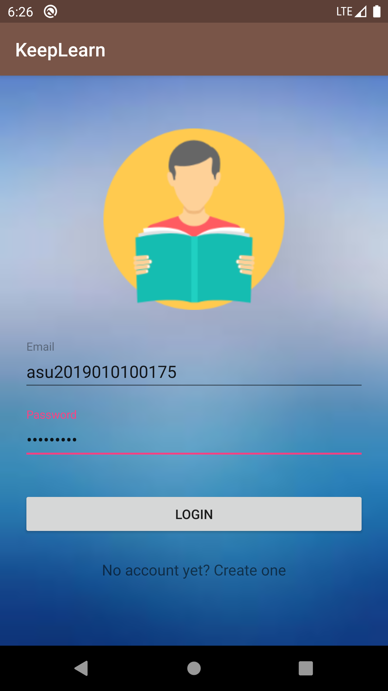
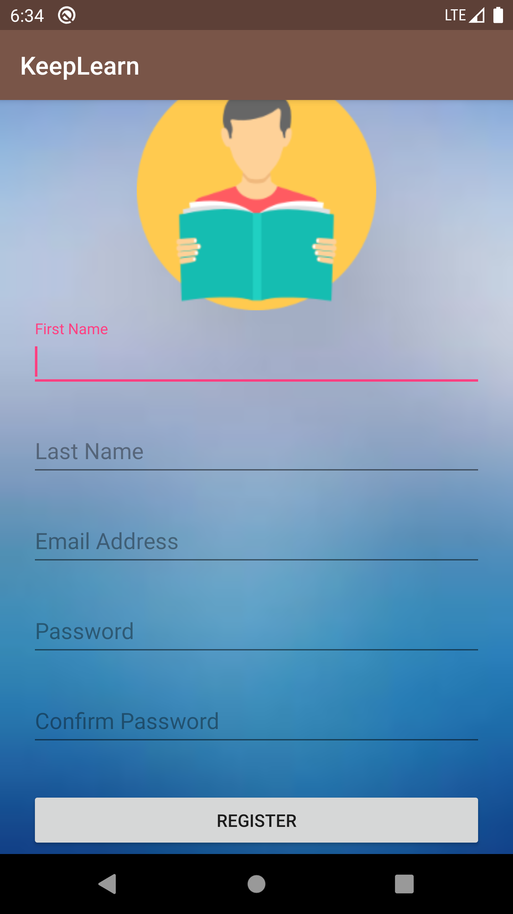
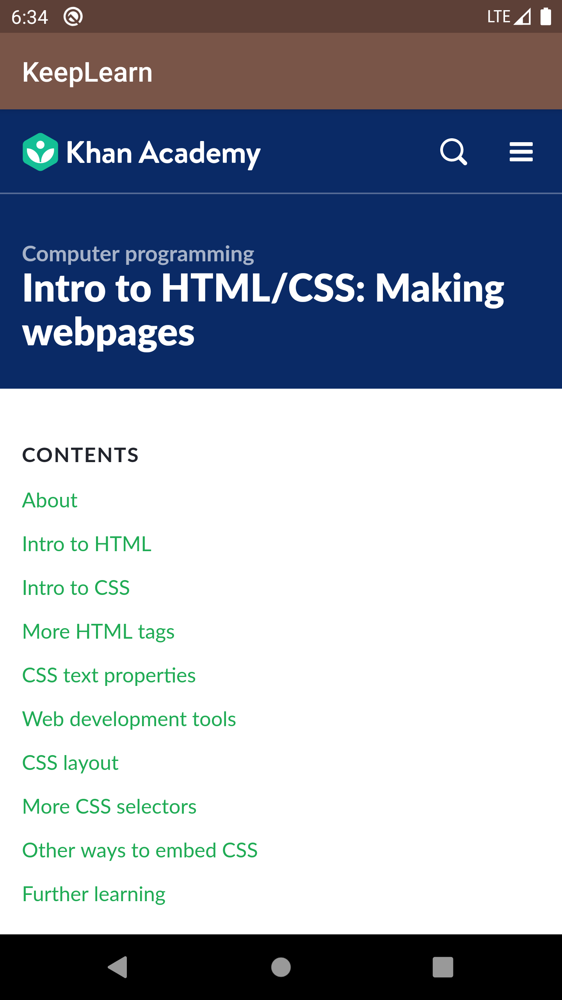
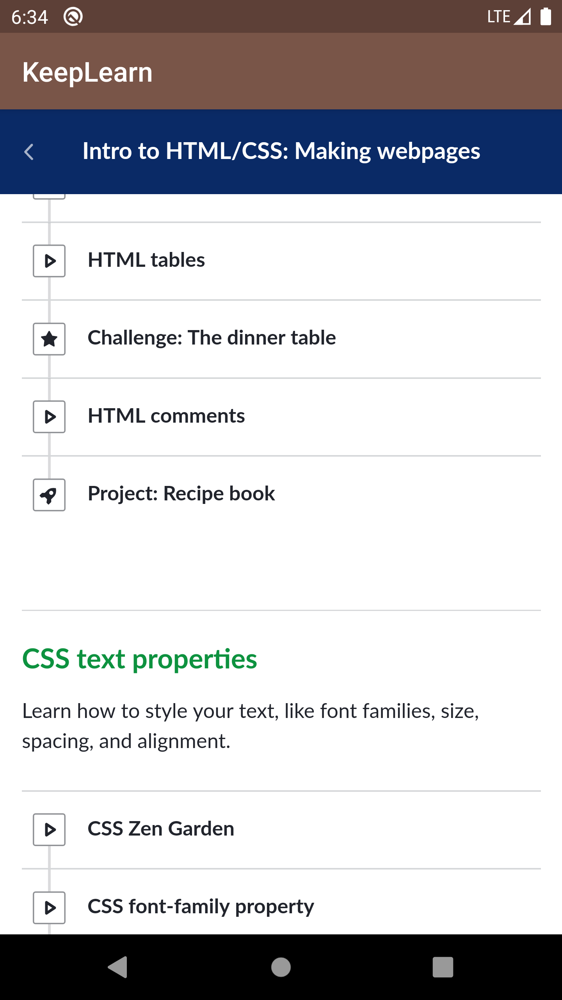
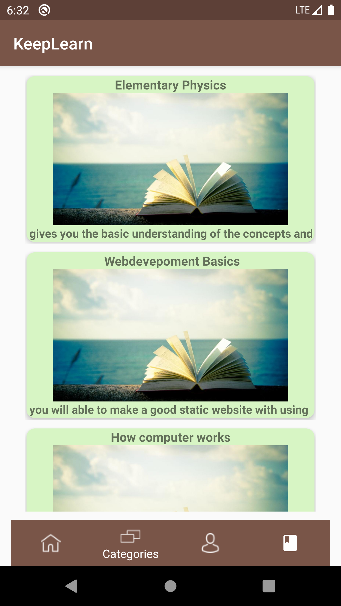
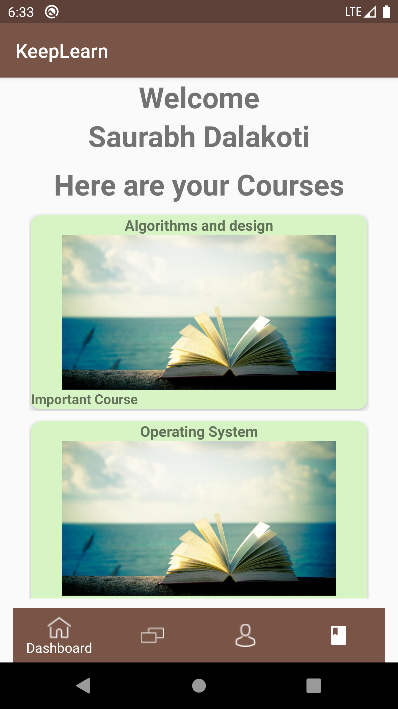

# HackASU
E - learning android app!

# Screenshots
<h1>Log In and Sign Up</h1>

 
<h1>See the course</h1>

 
<h1>Nominal features of E-Learning App </h1>

### Backend
<h4>The backend was developed in flask. Refer https://github.com/Dalakoti07/hack-asu-backend for code base</h4>